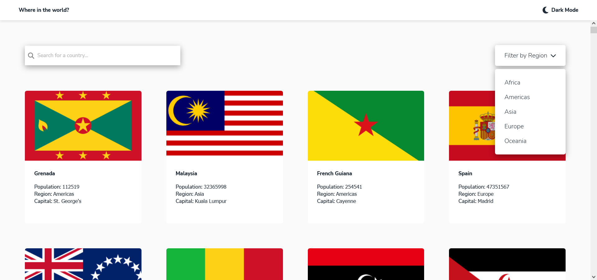
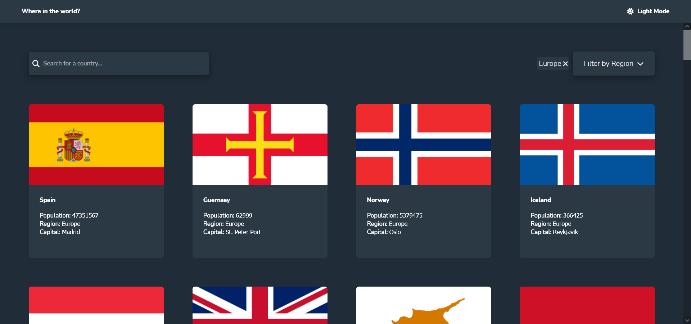
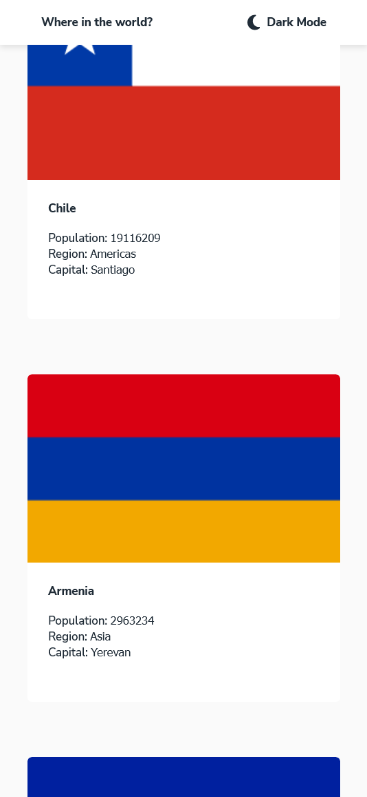
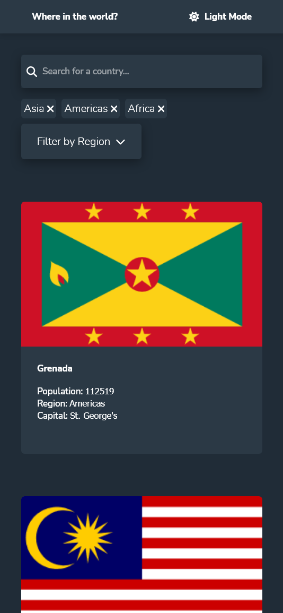

# Frontend Mentor - REST Countries API with color theme switcher solution

This is a solution to the [REST Countries API with color theme switcher challenge on Frontend Mentor](https://www.frontendmentor.io/challenges/rest-countries-api-with-color-theme-switcher-5cacc469fec04111f7b848ca). Frontend Mentor challenges help you improve your coding skills by building realistic projects.

## Overview

### The challenge

Users should be able to:

- See all countries from the API on the homepage
- Search for a country using an `input` field
- Filter countries by region
- Click on a country to see more detailed information on a separate page
- Click through to the border countries on the detail page
- Toggle the color scheme between light and dark mode *(optional)*

### Screenshots

### Links

- Solution URL: [Here](https://github.com/CristianB13/rest-countries-app)
- Live Site URL: [Here](https://rest-countries-app-13.netlify.app/)

### Built with

- Semantic HTML5 markup
- CSS custom properties
- Flexbox
- CSS Grid
- [Angular](https://angular.io/) - Web framework
- [Rest Countries Api](https://restcountries.com/)

### Useful resources
- [Angular Http Client](https://angular.io/guide/http)
- [Angular Pipes](https://angular.io/guide/pipes)
- [Angular Common Routing Tasks](https://angular.io/guide/router)
- [Angular Services](https://angular.io/guide/architecture-services)